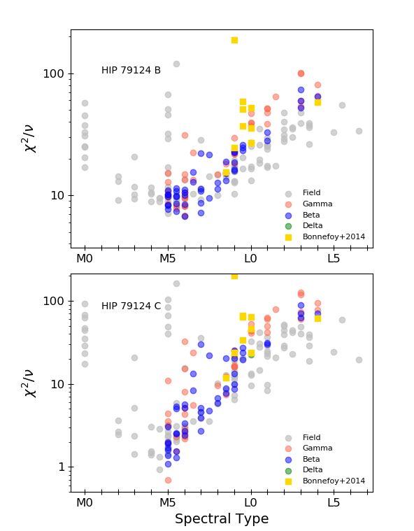
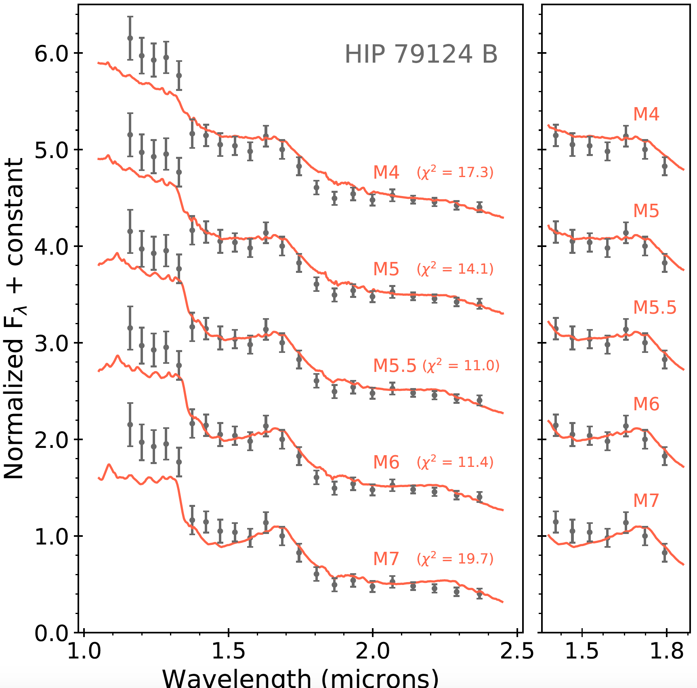

# Spectral-fit

<!-- PROJECT SHIELDS -->
<!--
*** I'm using markdown "reference style" links for readability.
*** Reference links are enclosed in brackets [ ] instead of parentheses ( ).
*** See the bottom of this document for the declaration of the reference variables
*** for contributors-url, forks-url, etc. This is an optional, concise syntax you may use.
*** https://www.markdownguide.org/basic-syntax/#reference-style-links
-->
[![LinkedIn][linkedin-shield]][linkedin-url]

3.5-yellow.svg?style=flat"> [">](https://github.com/avigan/SPHERE/blob/master/LICENSE) 

<!-- PROJECT LOGO -->
 

  

  <h3 align="center">Spectral fit</h3>

  

    A pipeline to fit and classify the infrared spectrum of low-mass stars
     
    <a href="https://github.com/rasensiotorres/Spectral-fit/"><strong>Explore the docs »</strong></a>
     
     
    <a href="https://github.com/rasensiotorres/Spectral-fit/">View Demo</a>
    ·
    <a href="https://github.com/rasensiotorres/Spectral-fit/issues">Report Bug</a>
    ·
    <a href="https://github.com/othneildrew/rasensiotorres/Spectral-fit/issues">Request Feature</a>
  

<!-- TABLE OF CONTENTS -->

  
Table of Contents

  <ol>
    <li>
      <a href="#about-the-project">About The Project</a>
      <ul>
        <li><a href="#built-with">Built With</a></li>
      </ul>
    </li>
    <li>
      <a href="#getting-started">Getting Started</a>
      <ul>
        <li><a href="#prerequisites">Prerequisites</a></li>
        <li><a href="#installation">Installation</a></li>
      </ul>
    </li>
    <li><a href="#usage">Usage</a></li>
    <li><a href="#roadmap">Roadmap</a></li>
    <li><a href="#contributing">Contributing</a></li>
    <li><a href="#license">License</a></li>
    <li><a href="#contact">Contact</a></li>
    <li><a href="#acknowledgements">Acknowledgements</a></li>
  </ol>

<!-- ABOUT THE PROJECT -->
## About The Project
 
 
This a routine to classify the infrared spectrum of low mass stars. The input spectrum is compared to spectral libraries of young objects via the chi-square goodness of fit statistic, including correlated errors. Youth is mostly indicated in low-resolution near-IR spectra in the triangular H-band continuum shape, which becomes less pronounced as one moves from very low(δ) to low(γ) and intermediate-gravity(β) late M- and L-type dwarfs. Other indicators exist also in the J and K bands, such as FeH absorption (McLean et al. 2003) or the K-band slope.

We can choose between two different spectral libraries::
* Montreal Spectral library (Gagne et al. (2015)): These objects are members of nearby young moving groups (≤120 Myr), with spectral types in the MLT range and δ, γ and β gravities. We consider only high S/N objects, leaving out those with median uncertainties larger than 5% of the median flux value. These spectra were obtained with several instruments, such as Flamingos − 2 and SpeX. Moreover, we include the near-IR Bonnefoy et al. (2014) VLT/SINFONI library of young dwarfs in the M − L transition (M8.5–L4).

* Dereddened near-IR standard spectral templates (Luhman et al. (2017)): Combination of several optical spectra for each subtype in the M spectral region. These
resulting templates are representatives of the Sco-Cen and TWA associations, with an age of about 10 Myrs. 

This routine has been used in the scientific paper [Asensio-Torres et al. 2019](https://ui.adsabs.harvard.edu/abs/2019A%26A...622A..42A/abstract), published in the Journal Astronomy & Astrophysics.

A list of commonly used resources that I find helpful are listed in the acknowledgements.

### Built With

This section should list any major frameworks that you built your project using. Leave any add-ons/plugins for the acknowledgements section. Here are a few examples.
* [Bootstrap](https://getbootstrap.com)
* [JQuery](https://jquery.com)
* [Laravel](https://laravel.com)

